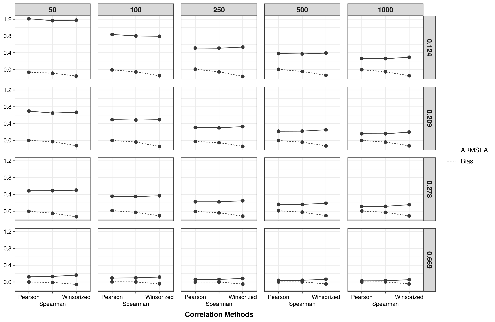

```{r setup, include=FALSE}
knitr::opts_chunk$set(echo = TRUE)
```

# Preparations for analysis

Loading packages to simulate and manipulate data. 

```{r}
library(tidyverse)
library(correlation)
```

# Import data

```{r}
dass <- readr::read_delim("data/DASS_data_21.02.19/data.csv", 
                          delim = "\t")
```


# Format data

```{r}
DASS_structure <- list(
  Depression = c(3, 5, 10, 13, 16, 17, 21, 24, 26, 31, 
                 34, 37, 38, 42),
  Anxiety = c(2, 4, 7, 9, 15, 19, 20, 23, 25, 28, 30, 
              36, 40, 41),
  Stress = c(1, 6, 8, 11, 12, 14, 18, 22, 27, 29, 32,
             33, 35, 39)
)

dass <- dass %>% 
  rowwise() %>% 
  mutate(
    Depression = sum(c_across(paste0("Q", 
                                     DASS_structure$Depression,
                                     "A"))),
    Anxiety = sum(c_across(paste0("Q", 
                                  DASS_structure$Anxiety,
                                  "A"))),
    Stress = sum(c_across(paste0("Q", 
                                 DASS_structure$Stress,
                                 "A")))
  ) %>% 
  ungroup() %>% 
  mutate(
    across(c(TIPI2, TIPI4, TIPI6, TIPI8), ~ 8 - .),
    Extraversion = TIPI1 + TIPI6,
    Agreeableness =  TIPI2 + TIPI7,
    Conscientiousness = TIPI3 + TIPI8,
    Emotional_Stability = TIPI4 + TIPI9,
    Openness = TIPI5 + TIPI10
  )
```

Remove cases that did not check know meaningless words:

```{r}
dass_format <- dass %>% 
  filter(VCL6 == 0,
         VCL9 == 0,
         VCL12 == 0) %>% 
  select(Depression, Anxiety, Agreeableness,
         Conscientiousness, Emotional_Stability)
```

# Data Analysis

# Population correlation

```{r}
correlation_population <- dass_format %>% 
  correlation() %>% 
  as_tibble()

correlation_population <- correlation_population %>% 
  filter(
    (Parameter1 == "Depression" & Parameter2 == "Anxiety") |
      (Parameter1 == "Conscientiousness" & Parameter2 == "Emotional_Stability") |
      (Parameter1 == "Agreeableness" & Parameter2 == "Emotional_Stability") |
      (Parameter1 == "Agreeableness" & Parameter2 == "Conscientiousness")
  )
```

# Sampling generation

```{r}
dass_nest <- dass_format %>% 
  group_nest() 

n_replic <- 500

set.seed(2022)
number_seed <- round(runif(n_replic, 1, 5000))

dass_sample_list <- list()
for(i in seq_len(n_replic)) {
  set.seed(number_seed[i]) 
  dass_sample_list[[i]] <- dass_nest %>% 
    mutate(
    sample_50 = map(data, 
                    ~ slice_sample(., n = 50)),
    sample_100 = map(data, 
                    ~ slice_sample(., n = 100)),
    sample_250 = map(data, 
                    ~ slice_sample(., n = 250)),
    sample_500 = map(data, 
                    ~ slice_sample(., n = 500)),
    sample_1000 = map(data, 
                      ~ slice_sample(., n = 1000)),
  )
}
```

```{r}
dass_sample_final <- bind_rows(dass_sample_list, 
                               .id = "Replication")
```

Format data to tidy structure

```{r}
dass_sample_final <- dass_sample_final %>% 
  select(-data) %>% 
  pivot_longer(
    cols = sample_50:sample_1000,
    names_to = "sample_n",
    values_to = "data"
  ) %>% 
  mutate(sample_n = str_remove(sample_n, "sample_")) %>% 
  unnest("data")
```

# Correlation analysis

## Pearson correlation

```{r}
correlation_pearson <- dass_sample_final %>% 
  group_by(sample_n, Replication) %>% 
  correlation(method = "pearson",
              p_adjust = "none") %>% 
  as_tibble()

correlation_pearson <- correlation_pearson %>% 
  filter(
    (Parameter1 == "Depression" & Parameter2 == "Anxiety") |
      (Parameter1 == "Conscientiousness" & Parameter2 == "Emotional_Stability") |
      (Parameter1 == "Agreeableness" & Parameter2 == "Emotional_Stability") |
      (Parameter1 == "Agreeableness" & Parameter2 == "Conscientiousness")
  )
```

## Spearman correlation:

```{r}
correlation_spearman <- dass_sample_final %>% 
  group_by(sample_n, Replication) %>% 
  correlation(method = "spearman",
              p_adjust = "none") %>% 
  as_tibble()

correlation_spearman <- correlation_spearman %>% 
  filter(
    (Parameter1 == "Depression" & Parameter2 == "Anxiety") |
      (Parameter1 == "Conscientiousness" & Parameter2 == "Emotional_Stability") |
      (Parameter1 == "Agreeableness" & Parameter2 == "Emotional_Stability") |
      (Parameter1 == "Agreeableness" & Parameter2 == "Conscientiousness")
  )
```

## Winzorized correlation:

```{r}
correlation_winzorized <- dass_sample_final %>% 
  group_by(sample_n, Replication) %>% 
  correlation(winsorize = 0.2,
              p_adjust = "none") %>% 
  as_tibble()

correlation_winzorized <- correlation_winzorized %>% 
  filter(
    (Parameter1 == "Depression" & Parameter2 == "Anxiety") |
      (Parameter1 == "Conscientiousness" & Parameter2 == "Emotional_Stability") |
      (Parameter1 == "Agreeableness" & Parameter2 == "Emotional_Stability") |
      (Parameter1 == "Agreeableness" & Parameter2 == "Conscientiousness")
  )
```


## Joined correlations

```{r}
correlation_joins <- correlation_pearson %>% 
  select(Group:r, Method) %>% 
  bind_rows(
    correlation_spearman %>% 
      select(Group:rho, Method) %>% 
      rename(r = rho),
    correlation_winzorized %>% 
      select(Group:r, Method)
  )
```

## Format correlation tibble

```{r}
correlation_format <- correlation_joins %>% 
  separate(Group,
           into = c("n", "rep"),
           sep = " - ") %>% 
  mutate(
    n = as.numeric(n),
    rep = factor(rep, 
                 levels = as.character(seq_len(n_replic))),
    Method = str_remove(Method, " correlation"),
    Method = fct_recode(Method,
                        "Winsorized" = "Winsorized Pearson")
  ) %>% 
  left_join(
    correlation_population %>% 
      select(Parameter1, Parameter2, correlation = r) %>% 
      mutate(correlation = round(correlation, 3))
  ) %>% 
  relocate(correlation, n, rep, Method) %>% 
  arrange(correlation, n, rep, Method)

correlation_format
```

# Evaluate correlation in data example 

## Calculate RMSEA and Bias

```{r}
correlation_evaluate <- correlation_format %>% 
  rowwise() %>% 
  mutate(
    dif_r = (r - correlation)/correlation
  ) %>% 
  group_by(correlation, n, Method) %>% 
  summarise(
    ARMSEA = sqrt(sum(dif_r^2)/n_replic),
    Bias = sum(dif_r)/n_replic
  ) %>% 
  ungroup() 

correlation_evaluate <- correlation_evaluate %>% 
  mutate(
    across(correlation:n, factor)
  ) %>% 
  pivot_longer(
    cols = ARMSEA:Bias,
    names_to = "Evaluate",
    values_to = "Value"
  )
```

## Generate plot

```{r}
plot_ev_data_B <- correlation_evaluate %>% 
  ggplot(aes(x = Method,
             y = Value,
             linetype = Evaluate,
             group = Evaluate)) +
  geom_point(color = "#3a3a3a", size = 2) +
  geom_path(color = "#3a3a3a") +
  labs(title = NULL,
       x = "Correlation Methods",
       y = NULL) +
  scale_x_discrete(guide = guide_axis(n.dodge = 2)) +
  facet_grid(correlation ~ n) +
  theme_bw() +
  theme(
    plot.title = element_text(hjust = 0.5,
                              size = 12,
                              face = "bold"),
    plot.subtitle = element_text(hjust = 0.5),
    text = element_text(
      size = 11,
      face="bold"), 
    axis.text = element_text(
      size = 9,
      face="plain",
      colour="black"),
    # axis.text.x = element_text(angle = 90),
    axis.title.x = element_text(
      size = 11,
      margin = margin(t = 7, r = 0, b = 0, l = 0)
    ),
    strip.text = element_text(
      size = 11
    ),
    legend.title = element_blank(),
    legend.text = element_text(
      face="plain",
      colour="black",
      size=10),
    panel.spacing = unit(0.8, "lines")
  )  

# ggsave(filename = "img/Evaluate_correlation_RMSEA_Bias_data_example_B.png",
#        plot = plot_ev_data_B, width = 10.75, height = 7,
#        dpi = 300)
```


```{r echo=FALSE, out.width='100%'}

```


