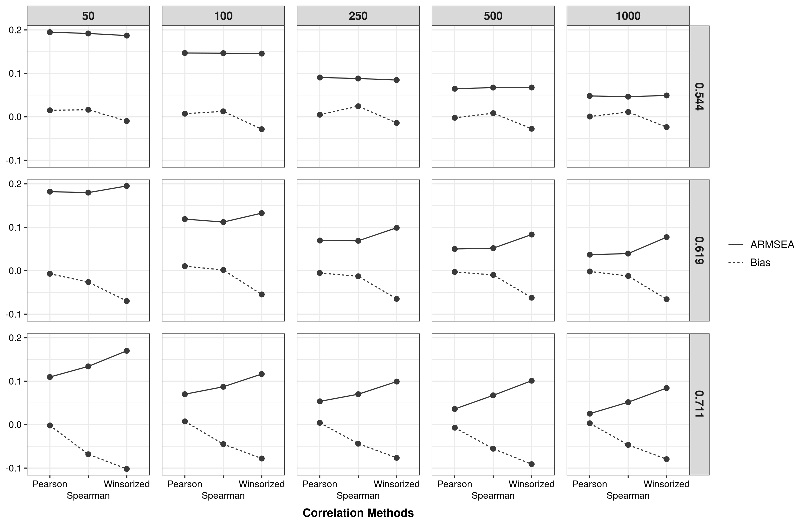

```{r setup, include=FALSE}
knitr::opts_chunk$set(echo = TRUE)
```

# Preparations for analysis

Loading packages to simulate and manipulate data. 

```{r}
library(tidyverse)
library(correlation)
```

# Import data

```{r}
academic <- readxl::read_excel("data/Base de datos - Calidad Academica.xlsx")
```


# Format data

```{r}
academic <- academic %>% 
  rowwise() %>% 
  mutate(
    ESA = sum(c_across(c(ES1:ES8))),
    UWES_direction = sum(c_across(c(UWES6, UWES9, 
                                    UWES11, UWES15))),
    UWES_activation = sum(c_across(c(UWES5, UWES7, UWES13,
                                     UWES2, UWES3, UWES4,
                                     UWES14, UWES17)))
  ) %>% 
  ungroup() %>% 
  select(ESA:UWES_activation)
```

# Data Analysis

# Population correlation

```{r}
correlation_population <- academic %>% 
  correlation() %>% 
  as_tibble()

correlation_population
```

# Sampling generation

```{r}
academic_nest <- academic %>% 
  group_nest() 

set.seed(2022)
number_seed <- round(runif(100, 1, 1000))

academic_sample_list <- list()
for(i in 1:100) {
  set.seed(number_seed[i]) 
  academic_sample_list[[i]] <- academic_nest %>% 
    mutate(
    sample_50 = map(data, 
                    ~ slice_sample(., n = 50)),
    sample_100 = map(data, 
                    ~ slice_sample(., n = 100)),
    sample_250 = map(data, 
                    ~ slice_sample(., n = 250)),
    sample_500 = map(data, 
                    ~ slice_sample(., n = 500)),
    sample_1000 = map(data, 
                      ~ slice_sample(., n = 1000)),
  )
}
```

```{r}
academic_sample_final <- bind_rows(academic_sample_list, 
                                   .id = "Replication")
```

Format data to tidy structure

```{r}
academic_sample_final <- academic_sample_final %>% 
  select(-data) %>% 
  pivot_longer(
    cols = sample_50:sample_1000,
    names_to = "sample_n",
    values_to = "data"
  ) %>% 
  mutate(sample_n = str_remove(sample_n, "sample_")) %>% 
  unnest("data")
```

# Correlation analysis

## Pearson correlation

```{r}
correlation_pearson <- academic_sample_final %>% 
  group_by(sample_n, Replication) %>% 
  correlation(method = "pearson",
              p_adjust = "none") %>% 
  as_tibble()

correlation_pearson
```

## Spearman correlation:

```{r}
correlation_spearman <- academic_sample_final %>% 
  group_by(sample_n, Replication) %>% 
  correlation(method = "spearman",
              p_adjust = "none") %>% 
  as_tibble()

correlation_spearman
```

## Winzorized correlation:

```{r}
correlation_winzorized <- academic_sample_final %>% 
  group_by(sample_n, Replication) %>% 
  correlation(winsorize = 0.2,
              p_adjust = "none") %>% 
  as_tibble()

correlation_winzorized
```


## Joined correlations

```{r}
correlation_joins <- correlation_pearson %>% 
  select(Group:r, Method) %>% 
  bind_rows(
    correlation_spearman %>% 
      select(Group:rho, Method) %>% 
      rename(r = rho),
    correlation_winzorized %>% 
      select(Group:r, Method)
  )
```

## Format correlation tibble

```{r}
correlation_format <- correlation_joins %>% 
  separate(Group,
           into = c("n", "rep"),
           sep = " - ") %>% 
  mutate(
    n = as.numeric(n),
    rep = factor(rep, 
                 levels = as.character(1:100)),
    Method = str_remove(Method, " correlation"),
    Method = fct_recode(Method,
                        "Winsorized" = "Winsorized Pearson")
  ) %>% 
  left_join(
    correlation_population %>% 
      select(Parameter1, Parameter2, correlation = r) %>% 
      mutate(correlation = round(correlation, 3))
  ) %>% 
  relocate(correlation, n, rep, Method) %>% 
  arrange(correlation, n, rep, Method)

correlation_format
```

# Evaluate correlation in data example 

## Calculate RMSEA and Bias

```{r}
correlation_evaluate <- correlation_format %>% 
  rowwise() %>% 
  mutate(
    dif_r = (r - correlation)/correlation
  ) %>% 
  group_by(correlation, n, Method) %>% 
  summarise(
    ARMSEA = sqrt(sum(dif_r^2)/100),
    Bias = sum(dif_r)/100
  ) %>% 
  ungroup() 

correlation_evaluate <- correlation_evaluate %>% 
  mutate(
    across(correlation:n, factor)
  ) %>% 
  pivot_longer(
    cols = ARMSEA:Bias,
    names_to = "Evaluate",
    values_to = "Value"
  )
```

## Generate plot

```{r}
plot_ev_data_A <- correlation_evaluate %>% 
  ggplot(aes(x = Method,
             y = Value,
             linetype = Evaluate,
             group = Evaluate)) +
  geom_point(color = "#3a3a3a", size = 2) +
  geom_path(color = "#3a3a3a") +
  labs(title = NULL,
       x = "Correlation Methods",
       y = NULL) +
  scale_x_discrete(guide = guide_axis(n.dodge = 2)) +
  facet_grid(correlation ~ n) +
  theme_bw() +
  theme(
    plot.title = element_text(hjust = 0.5,
                              size = 12,
                              face = "bold"),
    plot.subtitle = element_text(hjust = 0.5),
    text = element_text(
      size = 11,
      face="bold"), 
    axis.text = element_text(
      size = 9,
      face="plain",
      colour="black"),
    # axis.text.x = element_text(angle = 90),
    axis.title.x = element_text(
      size = 11,
      margin = margin(t = 7, r = 0, b = 0, l = 0)
    ),
    strip.text = element_text(
      size = 11
    ),
    legend.title = element_blank(),
    legend.text = element_text(
      face="plain",
      colour="black",
      size=10),
    panel.spacing = unit(0.8, "lines")
  )  

# ggsave(filename = "img/Evaluate_correlation_RMSEA_Bias_data_example_A.png",
#        plot = plot_ev_data_A, width = 10.75, height = 7,
#        dpi = 300)
```


```{r echo=FALSE, out.width='100%'}

```


