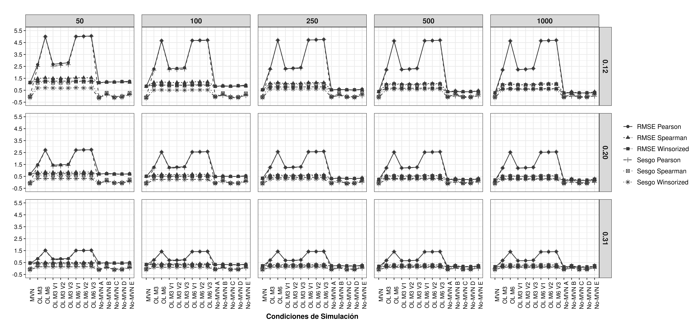
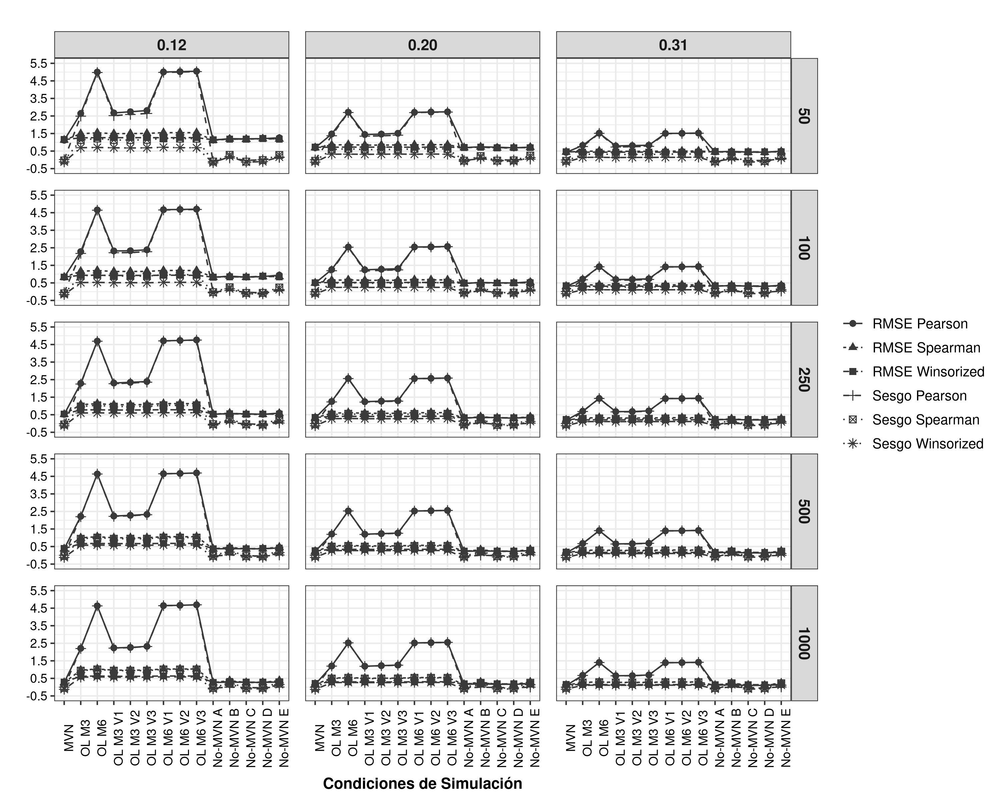
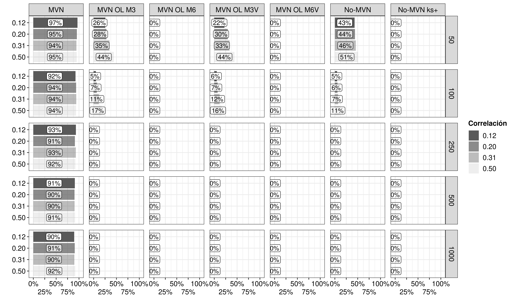
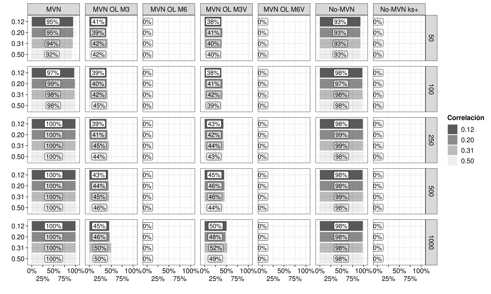

```{r setup, include=FALSE}
knitr::opts_chunk$set(echo = TRUE)
```

# Preparations for analysis

Loading packages to simulate and manipulate data. 

```{r}
library(MASS)
library(tidyverse)
```


# Simulate data

Data generation was performed according to the following conditions:

- Correlations: 0.12, 0.20, 0.31, 0.50
- Sample sizes: 50, 100, 250, 500, 1000
- Number of replications: 1000

In this way, 20 *dataframes* are generated with different amounts of data within each of them, which will have 1,000 *replications*. In total, 20,000 *dataframes* with observations for analysis.


## Generate matrices and observations

Create the variables that indicate the conditions

```{r}
set.seed(2020) 
r <- c(0.12, 0.20, 0.31, 0.50) ## Correlations 
n <- c(50, 100, 250, 500, 1000) ## Sample sizes
replic <- 1000
```


```{r}
sigma <- list()
for (i in seq_along(r)) { 
  sigma[[i]] <- matrix(data = c(1, rep(r[i], 2), 1),
                       nrow = 2,
                       ncol = 2)
}


# Generar los datos de correlación
df_cor <- list()
for (i in seq_along(sigma)) {
  df_cor[[i]] <- list()
  for (j in seq_along(n)) {
    df_cor[[i]][[j]] <- list()
    for (k in 1:replic) {
      df_cor[[i]][[j]][[k]] <- mvrnorm(n     = n[j],
                                       mu    = rep(0, 2),
                                       Sigma = sigma[[i]]) %>% 
        as_tibble()
    }
  }
}
```

## Format the data as dataframe / tibbles

We will assemble the list object in such a way that we can identify by columns the correlation, sample size and replicate number of each observation.

```{r}
# Unir los datos y pasarlo a formato tidy
temp <- df_cor
df_cor <- list()
for (i in seq_along(sigma)) {
  df_cor[[i]] <- list()
  for (j in seq_along(n)) {
    df_cor[[i]][[j]] <- temp[[i]][[j]] %>% 
      bind_rows(.id = "replic") %>% 
      mutate(replic = as.numeric(replic))
  }
  df_cor[[i]] <- df_cor[[i]] %>% 
    bind_rows(.id = "n") %>% 
    mutate(n = recode(n, "1" = 50, "2" = 100,
                      "3" = 250, "4" = 500, 
                      "5" = 1000))
}

df_cor <- df_cor %>% 
  bind_rows(.id = "correlacion") %>% 
  mutate(correlacion = recode(correlacion, "1" = 0.12,
                              "2" = 0.20, "3" = 0.31,
                              "4" = 0.50)) %>% 
  arrange(correlacion, n, replic)

# Crear data nest
df_nest <- df_cor %>% 
  nest(data = c(V1, V2))

rm(temp, i, j, k)
```

## Add outliers 

Five percent of the data in each data frame will be randomly replaced by outlier correlations different from the one generated. For example, in the case of a dataframe with a correlation of 0.12 and a sample size of 50, 3 pairs of correlations will be randomly replaced with 3 pairs of correlations generated with correlations of 0.20, 0.31 and 0.50.

```{r}
# Add the number of outliers to be added and their locations Outliers at 5%.
df_work <- df_nest %>% 
  rowwise() %>% 
  mutate(
    ratio_outlier = map_dbl(n,
                        ~ ceiling(0.05*n)),
    posici_rep_m3 = map2(n, ratio_outlier,
                         ~ sample(1:.x, .y)),
    posici_rep_m6 = map2(n, ratio_outlier,
                         ~ sample(1:.x, .y)),
    posici_rep_m3v1 = map2(n, ratio_outlier,
                          ~ sample(1:.x, .y)),
    posici_rep_m3v2 = map2(n, ratio_outlier,
                          ~ sample(1:.x, .y)),
    posici_rep_m3v3 = map2(n, ratio_outlier,
                          ~ sample(1:.x, .y)),
    posici_rep_m6v1 = map2(n, ratio_outlier,
                           ~ sample(1:.x, .y)),
    posici_rep_m6v2 = map2(n, ratio_outlier,
                           ~ sample(1:.x, .y)),
    posici_rep_m6v3 = map2(n, ratio_outlier,
                           ~ sample(1:.x, .y))
  )

# Add correlations that were not considered
df_work <- df_work %>% 
  mutate(
    correla_a = r[which(correlacion != r)[1]],
    correla_b = r[which(correlacion != r)[2]],
    correla_c = r[which(correlacion != r)[3]]
  )
```

On the correlations identified to be generated, the data matrix necessary for the multivariate simulation is created as an outlier.

```{r}
df_work <- df_work %>% 
  mutate(
    matrix = map(correlacion,
                 ~ matrix(data = rep(c(1, rep(.x, 2)), 2), 
                          nrow = 2,
                          ncol = 2)),
    matrix_a = map(correla_a,
                   ~ matrix(data = rep(c(1, rep(.x, 2)), 2), 
                            nrow = 2,
                            ncol = 2)),
    matrix_b = map(correla_b,
                   ~ matrix(data = rep(c(1, rep(.x, 2)), 2), 
                            nrow = 2,
                            ncol = 2)),
    matrix_c = map(correla_c,
                   ~ matrix(data = rep(c(1, rep(.x, 2)), 2), 
                            nrow = 2,
                            ncol = 2))
  ) %>% 
  ungroup()
```

Aggregate outliers are of 2 types: they vary only by the mean and they vary by the mean and its matrix:

- outlier_m3: Varies by an mean of 3 
- outlier_m6: Varies by an mean of 6
- outlier_m3v1: Varies by an mean of 3 and matrix a
- outlier_m3v2: Varies by an mean of 3 and matrix b
- outlier_m3v3: Varies by an mean of 3 and matrix c
- outlier_m6v1: Varies by an mean of 6 and matrix a
- outlier_m6v2: Varies by an mean of 6 and matrix b
- outlier_m6v3: Varies by an mean of 6 and matrix c

```{r}
set.seed(2019) 

df_work <- df_work %>% 
  mutate(
    outlier_m3 = map2(ratio_outlier, matrix, 
                      ~ mvrnorm(n     = .x,
                                mu    = rep(3, 2),
                                Sigma = .y) %>% 
                        as_tibble()),
    outlier_m6 = map2(ratio_outlier, matrix,
                      ~ mvrnorm(n     = .x,
                                mu    = rep(6, 2),
                                Sigma = .y) %>% 
                        as_tibble()),
    outlier_m3v1 = map2(ratio_outlier, matrix_a, 
                        ~ mvrnorm(n     = .x,
                                  mu    = rep(3, 2),
                                  Sigma = .y) %>% 
                          as_tibble()),
    outlier_m3v2 = map2(ratio_outlier, matrix_b, 
                        ~ mvrnorm(n     = .x,
                                  mu    = rep(3, 2),
                                  Sigma = .y) %>% 
                          as_tibble()),
    outlier_m3v3 = map2(ratio_outlier, matrix_c, 
                        ~ mvrnorm(n     = .x,
                                  mu    = rep(3, 2),
                                  Sigma = .y) %>% 
                          as_tibble()),
    outlier_m6v1 = map2(ratio_outlier, matrix_a, 
                        ~ mvrnorm(n     = .x,
                                  mu    = rep(6, 2),
                                  Sigma = .y) %>% 
                          as_tibble()),
    outlier_m6v2 = map2(ratio_outlier, matrix_b, 
                        ~ mvrnorm(n     = .x,
                                  mu    = rep(6, 2),
                                  Sigma = .y) %>% 
                          as_tibble()),
    outlier_m6v3 = map2(ratio_outlier, matrix_c, 
                        ~ mvrnorm(n     = .x,
                                  mu    = rep(6, 2),
                                  Sigma = .y) %>% 
                          as_tibble())
  )
```

These new simulated outlier correlations will be inserted into the initially calculated random positions in each dataframe.

```{r}
df_work <- df_work %>% 
  mutate(
    data_out_m3 = pmap(list(data, posici_rep_m3, outlier_m3),
                       ~ ..1 %>% 
                         slice(- ..2) %>% 
                         bind_rows(..3)),
    data_out_m6 = pmap(list(data, posici_rep_m6, outlier_m6),
                       ~ ..1 %>% 
                         slice(- ..2) %>% 
                         bind_rows(..3)),
    data_out_m3v1 = pmap(list(data, posici_rep_m3v1, outlier_m3v1),
                         ~ ..1 %>% 
                           slice(- ..2) %>% 
                           bind_rows(..3)),
    data_out_m3v2 = pmap(list(data, posici_rep_m3v2, outlier_m3v2),
                         ~ ..1 %>% 
                           slice(- ..2) %>% 
                           bind_rows(..3)),
    data_out_m3v3 = pmap(list(data, posici_rep_m3v3, outlier_m3v3),
                         ~ ..1 %>% 
                           slice(- ..2) %>% 
                           bind_rows(..3)),
    data_out_m6v1 = pmap(list(data, posici_rep_m6v1, outlier_m6v1),
                         ~ ..1 %>% 
                           slice(- ..2) %>% 
                           bind_rows(..3)),
    data_out_m6v2 = pmap(list(data, posici_rep_m6v2, outlier_m6v2),
                         ~ ..1 %>% 
                           slice(- ..2) %>% 
                           bind_rows(..3)),
    data_out_m6v3 = pmap(list(data, posici_rep_m6v3, outlier_m6v3),
                         ~ ..1 %>% 
                           slice(- ..2) %>% 
                           bind_rows(..3))
  )
```

Additionally, new dataframes with the same correlation conditions, sample size and number of replications with non-normal data distributions are generated using the algorithm of Vale and Maurelli (1983). 

Non-normality conditions were generated on the basis of the work of [Sheng & Sheng (2012)](https://www.ncbi.nlm.nih.gov/pmc/articles/PMC3279724/):

- skewness = 0.00, kurtosis = − 1.385 (symmetric platykurtic distribution);
- skewness = 0.00, kurtosis = 25 (symmetric leptokurtic distribution);
- skewness = 0.96, kurtosis = 0.13 (non-symmetric distribution);
- skewness = 0.48, kurtosis = − 0.92 (non-symmetric platykurtic distribution);
- skewness = 2.50, kurtosis = 25 (non-symmetric leptokurtic distribution).

```{r}
set.seed(2021) 
library(semTools)

df_work <- df_work %>% 
  mutate(
    data_nonorm1 = map2(n, matrix,
                        ~ mvrnonnorm(n = .x,
                                     mu = rep(0, 2),
                                     Sigma = .y,
                                     skewness = c(0),
                                     kurtosis = c(-1.385)) %>% # symmetric platykurtic distribution
                          as_tibble()),
    data_nonorm2 = map2(n, matrix,
                        ~ mvrnonnorm(n = .x,
                                     mu = rep(0, 2),
                                     Sigma = .y,
                                     skewness = 0,
                                     kurtosis = 25) %>% # symmetric leptokurtic distribution 
                          as_tibble()),
    data_nonorm3 = map2(n, matrix,
                        ~ mvrnonnorm(n = .x,
                                     mu = rep(0, 2),
                                     Sigma = .y,
                                     skewness = 0.96,
                                     kurtosis = 0.13) %>% # non-symmetric distribution
                          as_tibble()),
    data_nonorm4 = map2(n, matrix,
                        ~ mvrnonnorm(n = .x,
                                     mu = rep(0, 2),
                                     Sigma = .y,
                                     skewness = 0.48,
                                     kurtosis = -0.92) %>% # non-symmetric platykurtic distribution
                          as_tibble()),
    data_nonorm5 = map2(n, matrix,
                        ~ mvrnonnorm(n = .x,
                                     mu = rep(0, 2),
                                     Sigma = .y,
                                     skewness = 2.5,
                                     kurtosis = 25) %>% # non-symmetric leptokurtic distribution
                          as_tibble())
  )
```

Finally, the variables that will no longer be used are eliminated.

```{r}
df_work <- df_work %>% 
  select(-c(ratio_outlier:outlier_m6v3))

df_work
```


# Calculation of correlations

## Format tidy data
```{r}
df_work_tidy <- df_work %>% 
  pivot_longer(
    cols = data:data_nonorm5,
    names_to = "Tipo_Sim",
    values_to = "Data"
  )
```

## Correlations

```{r}
library(WRS2)
df_work_tidy <- df_work_tidy %>% 
  mutate(
    cort_pears = map(Data,
                     ~ cor.test(.x$V1, .x$V2,
                                method = "pearson")),
    cort_spear = map(Data,
                     ~ cor.test(.x$V1, .x$V2,
                                method = "spearman")),
    cort_winso = map(Data,
                     ~ wincor(.x$V1, .x$V2,
                              tr = 0.2))
  )
```

## Obtain the coefficients

```{r}
df_work_tidy <- df_work_tidy %>% 
  mutate(
    coef_pears = map_dbl(cort_pears,
                         ~ .x$estimate[1]),
    coef_spear = map_dbl(cort_spear,
                         ~ .x$estimate[1]),
    coef_winso = map_dbl(cort_winso,
                         ~ .x$cor[1])
  )

df_work_tidy_simp <- df_work_tidy %>% 
  select(-c(Data:cort_winso))
```

# Evaluate simulation

## Calculate RMSEA and Bias

```{r}
df_work_tidy_simp <- df_work_tidy_simp %>% 
  rowwise() %>% 
  mutate(
    dif_pears = (coef_pears - correlacion)/correlacion,
    dif_spear = (coef_spear - correlacion)/correlacion,
    dif_winso = (coef_winso - correlacion)/correlacion
  ) %>% 
  ungroup()

df_work_tidy_simp <- df_work_tidy_simp %>% 
  group_by(correlacion, n, Tipo_Sim) %>% 
  summarise(
    rmsea_pears = sqrt(sum(dif_pears^2)/1000),
    sesgo_pears = (sum(dif_pears)/1000),
    rmsea_spear = sqrt(sum(dif_spear^2)/1000),
    sesgo_spear = (sum(dif_spear)/1000),
    rmsea_winso = sqrt(sum(dif_winso^2)/1000),
    sesgo_winso = (sum(dif_winso)/1000)
  ) %>% 
  ungroup()

df_work_tidy_simp
```

## Recode simulation types

```{r}
df_work_tidy_simp <- df_work_tidy_simp %>% 
  mutate(
    Tipo_Sim = fct_recode(Tipo_Sim,
                          "MVN" = "data",
                          "OL M3" = "data_out_m3",
                          "OL M6" = "data_out_m6",
                          "OL M3 V1" = "data_out_m3v1",
                          "OL M3 V2" = "data_out_m3v2",
                          "OL M3 V3" = "data_out_m3v3",
                          "OL M6 V1" = "data_out_m6v1",
                          "OL M6 V2" = "data_out_m6v2",
                          "OL M6 V3" = "data_out_m6v3",
                          "No-MVN A" = "data_nonorm1",
                          "No-MVN B" = "data_nonorm2",
                          "No-MVN C" = "data_nonorm3",
                          "No-MVN D" = "data_nonorm4",
                          "No-MVN E" = "data_nonorm5"),
    Tipo_Sim = fct_relevel(Tipo_Sim,
                           "MVN", "OL M3", "OL M6", "OL M3 V1", 
                           "OL M3 V2", "OL M3 V3", "OL M6 V1",
                           "OL M6 V2", "OL M6 V3")
  ) %>% 
  arrange(correlacion, n, Tipo_Sim)
```

## Complete table about RMSEA and Bias

```{r}
df_work_tidy_simp_A <- df_work_tidy_simp %>% 
  relocate(contains("sesgo"), .after = "rmsea_winso")

df_work_tidy_simp_A
```

## Recalculation of RMSEA and Bias grouping conditions

```{r}
df_work_tidy_simp_B <- df_work_tidy_simp %>%
  mutate(
    Tipo_Sim = fct_collapse(Tipo_Sim,
                            "MVN" = "MVN",
                            "MVN OL M3" = "OL M3",
                            "MVN OL M6" = "OL M6",
                            "MVN OL M3V" = c("OL M3 V1", "OL M3 V2", "OL M3 V3"),
                            "MVN OL M6V" = c("OL M6 V1", "OL M6 V2", "OL M6 V3"),
                            "No-MVN" = c("No-MVN A", "No-MVN C", "No-MVN D"),
                            "No-MVN ks+" = c("No-MVN B", "No-MVN E")
    )
  ) %>% 
  relocate(contains("sesgo"), .after = "rmsea_winso")

df_work_tidy_simp_B <- df_work_tidy_simp_B %>% 
  group_by(correlacion, n, Tipo_Sim) %>% 
  summarise(
    across(everything(), mean)
  ) %>% 
  ungroup()

df_work_tidy_simp_B
```

## Format tidy data

```{r}
df_work_tidy_simp <- df_work_tidy_simp %>% 
  pivot_longer(
    cols = rmsea_pears:sesgo_winso,
    names_to = "Ajuste",
    values_to = "Valor"
  ) %>% 
  mutate(
    Ajuste = fct_recode(Ajuste,
                        "RMSE Pearson" = "rmsea_pears",
                        "RMSE Spearman" = "rmsea_spear",
                        "RMSE Winsorized" = "rmsea_winso",
                        "Sesgo Pearson" = "sesgo_pears",
                        "Sesgo Spearman" = "sesgo_spear",
                        "Sesgo Winsorized" = "sesgo_winso")
  )

df_work_tidy_simp
```

## Plots


```{r}
plot_assess_A <- df_work_tidy_simp %>%
  mutate(
    correlacion = factor(correlacion, 
                         labels = c("0.12", "0.20",
                                    "0.31", "0.50"))
  ) %>% 
  filter(correlacion != "0.50") %>% 
  ggplot(aes(x = Tipo_Sim, y = Valor,
             # colour = Ajuste,
             shape = Ajuste,
             linetype = Ajuste,
             group = Ajuste)) +
  geom_point(color = "#3a3a3a", size = 2) +
  geom_path(color = "#3a3a3a") +
  scale_y_continuous(limits = c(-0.5, 5.5),
                     breaks = seq(-0.5, 5.5, 1)) +
  labs(title = "",
       x = "Condiciones de Simulación",
       y = "") +
  # scale_x_discrete(guide = guide_axis(n.dodge = 2)) +
  facet_grid(correlacion ~ n) +
  theme_bw() +
  theme(
    plot.title = element_text(hjust = 0.5,
                              size = 12,
                              face = "bold"),
    plot.subtitle = element_text(hjust = 0.5),
    text = element_text(
      size = 11,
      face="bold"), 
    axis.text = element_text(
      size = 9,
      face="plain",
      colour="black"),
    axis.text.x = element_text(angle = 90),
    axis.title.x = element_text(
      size = 11,
      margin = margin(t = 7, r = 0, b = 0, l = 0)
    ),
    strip.text = element_text(
      size = 11
    ),
    legend.title = element_blank(),
    legend.text = element_text(
      face="plain",
      colour="black",
      size=10),
    panel.spacing = unit(0.8, "lines")
  ) 
```

```{r echo=FALSE, out.width='100%'}

```

```{r}
plot_assess_B <- df_work_tidy_simp %>%
  mutate(
    correlacion = factor(correlacion, 
                         labels = c("0.12", "0.20",
                                    "0.31", "0.50"))
  ) %>% 
  filter(correlacion != "0.50") %>% 
  ggplot(aes(x = Tipo_Sim, y = Valor,
             # colour = Ajuste,
             shape = Ajuste,
             linetype = Ajuste,
             group = Ajuste)) +
  geom_point(color = "#3a3a3a", size = 2) +
  geom_path(color = "#3a3a3a") +
  scale_y_continuous(limits = c(-0.5, 5.5),
                     breaks = seq(-0.5, 5.5, 1)) +
  labs(title = "",
       x = "Condiciones de Simulación",
       y = "") +
  # scale_x_discrete(guide = guide_axis(n.dodge = 2)) +
  facet_grid(n ~ correlacion) +
  theme_bw() +
  theme(
    plot.title = element_text(hjust = 0.5,
                              size = 12,
                              face = "bold"),
    plot.subtitle = element_text(hjust = 0.5),
    text = element_text(
      size = 11,
      face="bold"), 
    axis.text = element_text(
      size = 9,
      face="plain",
      colour="black"),
    axis.text.x = element_text(angle = 90),
    axis.title.x = element_text(
      size = 11,
      margin = margin(t = 7, r = 0, b = 0, l = 0)
    ),
    strip.text = element_text(
      size = 11
    ),
    legend.title = element_blank(),
    legend.text = element_text(
      face="plain",
      colour="black",
      size=10),
    panel.spacing = unit(0.8, "lines")
  ) 
```

```{r echo=FALSE, out.width='100%'}

```

# Evaluate normality

## Calculation of kurtosis and skewness for each variable

```{r}
library(e1071)

df_work_tidy_evaluate <- df_work_tidy %>% 
  mutate(
    kurtosis_v1 = map_dbl(Data,
                          ~ kurtosis(.x$V1, type = 2)),
    kurtosis_v2 = map_dbl(Data,
                          ~ kurtosis(.x$V2, type = 2)),
    skewness_v1 = map_dbl(Data,
                          ~ skewness(.x$V1, type = 2)),
    skewness_v2 = map_dbl(Data,
                          ~ skewness(.x$V2, type = 2))
  ) %>% 
  select(-c(cort_pears:coef_winso))

df_work_tidy_evaluate
```

## Calculation evaluating multivariate normality

### Settings multicore
```{r}
library(multidplyr)

if (Sys.getenv("RSTUDIO") == "1" && !nzchar(Sys.getenv("RSTUDIO_TERM")) && 
    (Sys.info()["sysname"] == "Darwin" || Sys.info()["sysname"] == "Linux") && 
    getRversion() >= "4.0.0") {
  parallel:::setDefaultClusterOptions(setup_strategy = "sequential")
}

cluster <- new_cluster(parallel::detectCores())
```

### Evaluation

```{r}
df_work_tidy_evaluate <- df_work_tidy_evaluate %>% 
  partition(cluster) %>% 
  mutate(
    Normal_multi_r = purrr::map_chr(Data,
                             ~ MVN::mvn(.x)$multivariateNormality$Result[3]),
    Normal_multi_r = ifelse(Normal_multi_r == "YES", "Si", "No")
  ) %>% 
  collect()
```

### Categorize by kurtosis and skewness

```{r}
df_work_tidy_evaluate <- df_work_tidy_evaluate %>% 
  mutate(
    norm_uni = ifelse(kurtosis_v1 >= - 1.5 & kurtosis_v1 <= 1.5 &
                        skewness_v1 >= - 1.5 & skewness_v1 <= 1.5 &
                        kurtosis_v2 >= - 1.5 & kurtosis_v2 <= 1.5 &
                        skewness_v2 >= - 1.5 & skewness_v2 <= 1.5, 
                      "Si", "No")
  )
```

## Format tidy data

```{r}
df_work_tidy_evaluate <- df_work_tidy_evaluate %>%
  mutate(
    Tipo_Sim = fct_recode(Tipo_Sim,
                          "MVN" = "data",
                          "OL M3" = "data_out_m3",
                          "OL M6" = "data_out_m6",
                          "OL M3 V1" = "data_out_m3v1",
                          "OL M3 V2" = "data_out_m3v2",
                          "OL M3 V3" = "data_out_m3v3",
                          "OL M6 V1" = "data_out_m6v1",
                          "OL M6 V2" = "data_out_m6v2",
                          "OL M6 V3" = "data_out_m6v3",
                          "No-MVN A" = "data_nonorm1",
                          "No-MVN B" = "data_nonorm2",
                          "No-MVN C" = "data_nonorm3",
                          "No-MVN D" = "data_nonorm4",
                          "No-MVN E" = "data_nonorm5"),
    Tipo_Sim = fct_relevel(Tipo_Sim,
                           "MVN", "OL M3", "OL M6", "OL M3 V1", 
                           "OL M3 V2", "OL M3 V3", "OL M6 V1",
                           "OL M6 V2", "OL M6 V3")
  ) %>% 
  arrange(correlacion, n, Tipo_Sim)

df_work_tidy_evaluate
```

## Data format for evaluation

Complete:

```{r}
df_work_tidy_A <- df_work_tidy_evaluate %>% 
  select(correlacion:Tipo_Sim, Normal_multi_r:norm_uni) %>%
  pivot_longer(
    cols = Normal_multi_r:norm_uni,
    names_to = "Evaluación Normalidad",
    values_to = "Dx"
  ) %>%
  mutate(
    `Evaluación Normalidad` = ifelse(`Evaluación Normalidad` == "Normal_multi_r",
                                     "Normalidad mardia", "Normalidad As y Ks")
  )
```

Grouped:

```{r}
df_work_tidy_simp_B <- df_work_tidy_evaluate %>%
  mutate(
    Tipo_Sim = fct_collapse(Tipo_Sim,
                            "MVN" = "MVN",
                            "MVN OL M3" = "OL M3",
                            "MVN OL M6" = "OL M6",
                            "MVN OL M3V" = c("OL M3 V1", "OL M3 V2", "OL M3 V3"),
                            "MVN OL M6V" = c("OL M6 V1", "OL M6 V2", "OL M6 V3"),
                            "No-MVN" = c("No-MVN A", "No-MVN C", "No-MVN D"),
                            "No-MVN ks+" = c("No-MVN B", "No-MVN E")
    )
  ) %>%
  select(correlacion:Tipo_Sim, Normal_multi_r:norm_uni) %>%
  pivot_longer(
    cols = Normal_multi_r:norm_uni,
    names_to = "Evaluación Normalidad",
    values_to = "Dx"
  ) %>%
  mutate(
    `Evaluación Normalidad` = ifelse(`Evaluación Normalidad` == "Normal_multi_r",
                                     "Normalidad mardia", "Normalidad As y Ks")
  )
```


## Plots

### Plot Mardia full

Calculate the percentage of dataframes identified as multivariate normal in each condition.

```{r}
df_work_tidy_A_mardia <- df_work_tidy_A %>% 
  filter(`Evaluación Normalidad` == "Normalidad mardia") %>% 
  count(correlacion, n, Tipo_Sim,
        Dx, name = "Cantidad") %>% 
  group_by(correlacion, n, Tipo_Sim) %>% 
  mutate(Porcentaje = Cantidad/sum(Cantidad)) %>% 
  select(-Cantidad) %>% 
  pivot_wider(
    names_from = Dx,
    values_from = Porcentaje,
    values_fill = 0
  ) %>% 
  ungroup()

df_work_tidy_A_mardia
```

Plot generation:

```{r}
plot_A_mardia <- df_work_tidy_A_mardia %>% 
  mutate(correlacion = factor(correlacion,
                              labels = c("0.12", "0.20",
                                         "0.31", "0.50")),
         correlacion = fct_rev(correlacion)) %>% 
  ggplot(aes(x = Si, y = correlacion,
             alpha = correlacion, label = scales::percent(Si, 
                                                          accuracy = 1))) +
  geom_col() +
  facet_grid(n ~ Tipo_Sim)  +
  scale_alpha_discrete(
    name = "Correlación",
    guide = guide_legend(reverse = TRUE)
  ) + 
  scale_x_continuous(
    limits = c(0, 1),
    breaks = c(0, 0.25, 0.50, 0.75, 1),
    labels = scales::percent_format(),
    expand = c(0, 0.1),
    guide = guide_axis(n.dodge = 2)
  ) +
  geom_label(
    size = 3.5,
    label.size = 0.25, 
    label.r = unit(0.15, "lines"),
    label.padding = unit(0.15, "lines"),
    position = position_stack(vjust = 0.5),
    show.legend = FALSE
  ) +
  labs(
    y = "",
    x = ""
  ) + 
  theme_bw() +
  theme(
    plot.title = element_text(hjust = 0.5),
    plot.subtitle = element_text(hjust = 0.5),
    text = element_text(
      size = 11,
      face="bold"), 
    axis.text = element_text(
      size = 11,
      face="plain",
      colour="black"),
    legend.title = element_text(
      size = 11,
      face = "bold"
    ),
    legend.text = element_text(
      face="plain",
      colour="black",
      size=11),
    strip.text = element_text(
      face="plain",
      colour="black",
      size=11),
    panel.spacing = unit(0.6, "lines")
  ) 
```


### Plot Skewness and Kurtosis full

Calculate the percentage of dataframes identified as univariate normality in each condition.

```{r}
df_work_tidy_A_as_ks <- df_work_tidy_A %>% 
  filter(`Evaluación Normalidad` == "Normalidad As y Ks") %>% 
  count(correlacion, n, Tipo_Sim,
        Dx, name = "Cantidad") %>% 
  group_by(correlacion, n, Tipo_Sim) %>% 
  mutate(Porcentaje = Cantidad/sum(Cantidad)) %>% 
  select(-Cantidad) %>% 
  pivot_wider(
    names_from = Dx,
    values_from = Porcentaje,
    values_fill = 0
  ) %>% 
  ungroup()
```

Plot generation:

```{r}
plot_A_as_ks <- df_work_tidy_A_as_ks %>% 
  mutate(correlacion = factor(correlacion,
                              labels = c("0.12", "0.20",
                                         "0.31", "0.50")),
         correlacion = fct_rev(correlacion)) %>% 
  ggplot(aes(x = Si, y = correlacion,
             alpha = correlacion, label = scales::percent(Si, 
                                                          accuracy = 1))) +
  geom_col() +
  facet_grid(n ~ Tipo_Sim)  +
  scale_alpha_discrete(
    name = "Correlación",
    guide = guide_legend(reverse = TRUE)
  ) + 
  scale_x_continuous(
    limits = c(0, 1),
    breaks = c(0, 0.25, 0.50, 0.75, 1),
    labels = scales::percent_format(),
    expand = c(0, 0.1),
    guide = guide_axis(n.dodge = 2)
  ) +
  geom_label(
    size = 3.5,
    label.size = 0.25, 
    label.r = unit(0.15, "lines"),
    label.padding = unit(0.15, "lines"),
    position = position_stack(vjust = 0.5),
    show.legend = FALSE
  ) +
  labs(
    y = "",
    x = ""
  ) + 
  theme_bw() +
  theme(
    plot.title = element_text(hjust = 0.5),
    plot.subtitle = element_text(hjust = 0.5),
    text = element_text(
      size = 11,
      face="bold"), 
    axis.text = element_text(
      size = 11,
      face="plain",
      colour="black"),
    legend.title = element_text(
      size = 11,
      face = "bold"
    ),
    legend.text = element_text(
      face="plain",
      colour="black",
      size=11),
    strip.text = element_text(
      face="plain",
      colour="black",
      size=11),
    panel.spacing = unit(0.6, "lines")
  ) 
```


### Plot Mardia grouped

Calculate the percentage of dataframes identified as multivariate normal in each condition.

```{r}
df_work_tidy_B_mardia <- df_work_tidy_simp_B %>% 
  filter(`Evaluación Normalidad` == "Normalidad mardia") %>% 
  count(correlacion, n, Tipo_Sim,
        Dx, name = "Cantidad") %>% 
  group_by(correlacion, n, Tipo_Sim) %>% 
  mutate(Porcentaje = Cantidad/sum(Cantidad)) %>% 
  select(-Cantidad) %>% 
  pivot_wider(
    names_from = Dx,
    values_from = Porcentaje,
    values_fill = 0
  ) %>% 
  ungroup()
```

Plot generation:

```{r}
plot_B_mardia <- df_work_tidy_B_mardia %>% 
  mutate(correlacion = factor(correlacion,
                              labels = c("0.12", "0.20",
                                         "0.31", "0.50")),
         correlacion = fct_rev(correlacion)) %>% 
  ggplot(aes(x = Si, y = correlacion,
             alpha = correlacion, label = scales::percent(Si, 
                                                          accuracy = 1))) +
  geom_col() +
  facet_grid(n ~ Tipo_Sim)  +
  scale_alpha_discrete(
    name = "Correlación",
    guide = guide_legend(reverse = TRUE)
  ) + 
  scale_x_continuous(
    limits = c(0, 1),
    breaks = c(0, 0.25, 0.50, 0.75, 1),
    labels = scales::percent_format(),
    expand = c(0, 0.1),
    guide = guide_axis(n.dodge = 2)
  ) +
  geom_label(
    size = 3.5,
    label.size = 0.25, 
    label.r = unit(0.15, "lines"),
    label.padding = unit(0.15, "lines"),
    position = position_stack(vjust = 0.5),
    show.legend = FALSE
  ) +
  labs(
    y = "",
    x = ""
  ) + 
  theme_bw() +
  theme(
    plot.title = element_text(hjust = 0.5),
    plot.subtitle = element_text(hjust = 0.5),
    text = element_text(
      size = 11,
      face="bold"), 
    axis.text = element_text(
      size = 11,
      face="plain",
      colour="black"),
    legend.title = element_text(
      size = 11,
      face = "bold"
    ),
    legend.text = element_text(
      face="plain",
      colour="black",
      size=11),
    strip.text = element_text(
      face="plain",
      colour="black",
      size=11),
    panel.spacing = unit(0.6, "lines")
  ) 
```




### Plot Skewness and Kurtosis grouped


Calculate the percentage of dataframes identified as univariate normality in each condition.

```{r}
df_work_tidy_B_as_ks <- df_work_tidy_simp_B %>% 
  filter(`Evaluación Normalidad` == "Normalidad As y Ks") %>% 
  count(correlacion, n, Tipo_Sim,
        Dx, name = "Cantidad") %>% 
  group_by(correlacion, n, Tipo_Sim) %>% 
  mutate(Porcentaje = Cantidad/sum(Cantidad)) %>% 
  select(-Cantidad) %>% 
  pivot_wider(
    names_from = Dx,
    values_from = Porcentaje,
    values_fill = 0
  ) %>% 
  ungroup()
```

Plot Generation:

```{r}
plot_B_as_ks <- df_work_tidy_B_as_ks %>% 
  mutate(correlacion = factor(correlacion,
                              labels = c("0.12", "0.20",
                                         "0.31", "0.50")),
         correlacion = fct_rev(correlacion)) %>% 
  ggplot(aes(x = Si, y = correlacion,
             alpha = correlacion, label = scales::percent(Si, 
                                                          accuracy = 1))) +
  geom_col() +
  facet_grid(n ~ Tipo_Sim)  +
  scale_alpha_discrete(
    name = "Correlación",
    guide = guide_legend(reverse = TRUE)
  ) + 
  scale_x_continuous(
    limits = c(0, 1),
    breaks = c(0, 0.25, 0.50, 0.75, 1),
    labels = scales::percent_format(),
    expand = c(0, 0.1),
    guide = guide_axis(n.dodge = 2)
  ) +
  geom_label(
    size = 3.5,
    label.size = 0.25, 
    label.r = unit(0.15, "lines"),
    label.padding = unit(0.15, "lines"),
    position = position_stack(vjust = 0.5),
    show.legend = FALSE
  ) +
  labs(
    y = "",
    x = ""
  ) + 
  theme_bw() +
  theme(
    plot.title = element_text(hjust = 0.5),
    plot.subtitle = element_text(hjust = 0.5),
    text = element_text(
      size = 11,
      face="bold"), 
    axis.text = element_text(
      size = 11,
      face="plain",
      colour="black"),
    legend.title = element_text(
      size = 11,
      face = "bold"
    ),
    legend.text = element_text(
      face="plain",
      colour="black",
      size=11),
    strip.text = element_text(
      face="plain",
      colour="black",
      size=11),
    panel.spacing = unit(0.6, "lines")
  ) 
```

